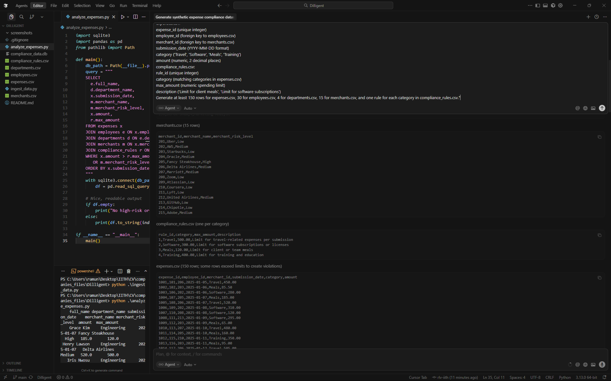
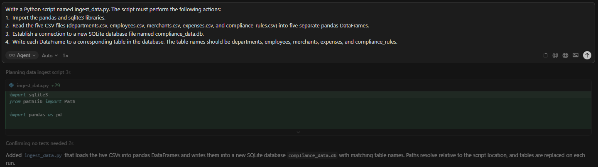
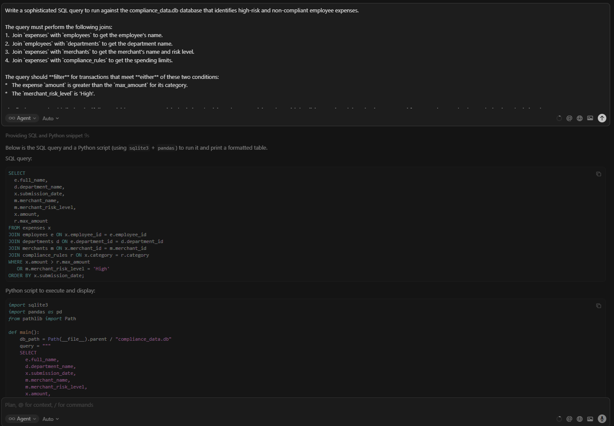
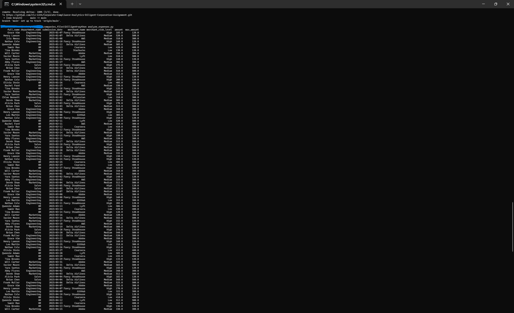

# Corporate Compliance Analytics Project

A simulation of a Governance, Risk, and Compliance (GRC) data pipeline designed to automatically detect non-compliant corporate expenses. This project was developed as a technical assessment for Diligent Corporation.

## 1. Project Goal

The primary objective of this project was to build an end-to-end data analysis pipeline using an AI-assisted IDE (Cursor). The system needed to model a real-world GRC scenario: ingesting employee expense data, comparing it against a set of business rules, and generating a clear report of all violations. This demonstrates a practical understanding of data modeling, ETL (Extract, Transform, Load) processes, and complex SQL querying for risk detection.

## 2. Key Features & Technologies Demonstrated

*   **Data Modeling:** Designing a normalized, five-table relational schema (`employees`, `departments`, `merchants`, `expenses`, `rules`).
*   **ETL Pipeline:** Scripting an automated process to extract data from CSV files and load it into a SQLite database.
*   **Complex SQL Querying:** Writing a sophisticated, multi-join query to identify transactions based on dual-condition logic (over-budget OR high-risk vendor).
*   **AI-Assisted Development:** Leveraging AI prompts within Cursor to rapidly generate synthetic data and boilerplate code, demonstrating efficiency with modern development tools.
*   **Languages & Libraries:** Python, pandas, SQLite.
*   **Version Control:** Git, with a structured, multi-commit history.

## 3. How It Works: A Step-by-Step Chronicle

This project was built iteratively using a series of logical prompts to the AI assistant.

### 3.1: Data Generation — Crafting the Raw Material

**Objective:** To create a rich, realistic, and normalized dataset to support a meaningful compliance analysis.

**Logic:** A normalized, multi-table data structure was chosen over a single flat file to demonstrate an understanding of proper database design. This allows for more complex and efficient queries. Including a `merchant_risk_level` adds a classic GRC dimension to the data, enabling a more nuanced analysis.

**Prompt given to Cursor IDE:**
```prompt
"Generate five interconnected synthetic datasets in CSV format for a corporate expense compliance system. Please ensure some expenses intentionally violate the compliance rules.
departments.csv:
department_id (unique integer)
department_name ('Sales', 'Engineering', 'HR', 'Marketing')
cost_center_code (e.g., 'SLS-101', 'ENG-202')
employees.csv:
employee_id (unique integer)
full_name (string)
department_id (foreign key to departments.csv)
job_title (e.g., 'Sales Director', 'Software Engineer')
merchants.csv:
merchant_id (unique integer)
merchant_name ('Uber', 'AWS', 'Starbucks', 'Oracle', 'Fancy Steakhouse')
merchant_risk_level ('Low', 'Medium', 'High') - Assign 'High' to vendors like 'Fancy Steakhouse'.
expenses.csv:
expense_id (unique integer)
employee_id (foreign key to employees.csv)
merchant_id (foreign key to merchants.csv)
submission_date (YYYY-MM-DD format)
category ('Travel', 'Software', 'Meals', 'Training')
amount (numeric, 2 decimal places)
compliance_rules.csv:
rule_id (unique integer)
category (matching categories in expenses.csv)
max_amount (numeric spending limit)
description ('Limit for client meals', 'Limit for software subscriptions')
Generate at least 150 rows for expenses.csv, 30 for employees.csv, 4 for departments.csv, 15 for merchants.csv, and one rule for each category in compliance_rules.csv."
```

**Outcome:** The AI successfully generated five distinct but related CSV files, providing a solid foundation for the project.
*This stage was committed with `feat: Add synthetic corporate compliance data (5 CSVs)`.*



---

### 3.2: Database Ingestion — Structuring the Data

**Objective:** To load the raw data from the CSV files into a persistent, queryable SQL database.

**Logic:** A Python script utilizing the industry-standard `pandas` and `sqlite3` libraries was created to automate the data loading process. This makes the data ingestion repeatable and robust.

**Prompt given to Cursor IDE:**
```prompt
Write a Python script named ingest_data.py. The script must perform the following actions:
1.  Import the pandas and sqlite3 libraries.
2.  Read the five CSV files (departments.csv, employees.csv, merchants.csv, expenses.csv, and compliance_rules.csv) into five separate pandas DataFrames.
3.  Establish a connection to a new SQLite database file named compliance_data.db.
4.  Write each DataFrame to a corresponding table in the database. The table names should be departments, employees, merchants, expenses, and compliance_rules.
```

**Outcome:** The AI generated `ingest_data.py`. Executing this script created the `compliance_data.db` file, fully populated with the project's data.
*This stage was committed with `feat: Create script to ingest CSV data into SQLite DB`.*



---

### 3.3: Compliance Analysis — Uncovering Insights

**Objective:** The core of the project. To write a query that could intelligently identify and report all suspicious transactions from the database.

**Logic:** A sophisticated SQL query involving multiple `JOIN`s was required to link all five tables together. The `WHERE` clause uses `OR` logic to flag a transaction if it meets *either* of two conditions: (1) the expense amount exceeds the policy limit for its category, or (2) the expense was made at a merchant classified as 'High' risk.

**Prompt given to Cursor IDE:**
```prompt
Write a sophisticated SQL query to run against the compliance_data.db database that identifies high-risk and non-compliant employee expenses.

The query must perform the following joins:
1.  Join `expenses` with `employees` to get the employee's name.
2.  Join `employees` with `departments` to get the department name.
3.  Join `expenses` with `merchants` to get the merchant's name and risk level.
4.  Join `expenses` with `compliance_rules` to get the spending limits.

The query should **filter** for transactions that meet **either** of these two conditions:
*   The expense `amount` is greater than the `max_amount` for its category.
*   The `merchant_risk_level` is 'High'.

The final output should display the `full_name`, `department_name`, `submission_date`, `merchant_name`, `merchant_risk_level`, `amount`, and the rule's `max_amount` for comparison. Order the results by the submission date.

Also, provide the full Python script using the `sqlite3` and `pandas` libraries to execute this query and print the results as a clean, formatted table.
```

**Outcome:** The AI generated the `analyze_expenses.py` script. Running this script produced the final compliance report, successfully identifying all policy violations and high-risk expenditures.
*This stage was committed with `feat: Implement expense analysis to flag violations`.*


## 4. Final Result: The Compliance Report

Executing the final script (`analyze_expenses.py`) connects to the database, runs the analysis, and produces the final, clear report of all transactions that were flagged as non-compliant or high-risk, printed directly to the terminal.



## 5. How to Run This Project

1.  **Prerequisites:**
    Ensure you have Python and the pandas library installed.
    ```bash
    pip install pandas
    ```

2.  **Populate the Database:**
    Run the ingestion script from your terminal. This will read the CSVs and create the `compliance_data.db` file.
    ```bash
    python ingest_data.py
    ```

3.  **Run the Analysis:**
    Execute the analysis script to query the database and view the final compliance report in your terminal.
    ```bash
    python analyze_expenses.py
    ```

## 5. Project File Structure

*   **`departments.csv`, `employees.csv`, `merchants.csv`, `expenses.csv`, `compliance_rules.csv`**: The five raw, synthetic data files.
*   **`ingest_data.py`**: The ETL script that reads the CSV files and populates the SQLite database.
*   **`analyze_expenses.py`**: The analysis script that queries the database and prints the final report of non-compliant transactions.
*   **`.gitignore`**: Specifies that the generated database file (`compliance_data.db`) should not be tracked by Git.
